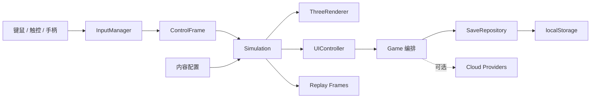

# 技术架构与扩展设计

## 1. 目标与边界

当前版本定位为“可直接发布测试的离线优先 Web 3D 游戏”。战斗核心不依赖 DOM、Three.js 或云端 SDK，因此可以继续演进为 Web、PWA、桌面壳和轻量原生容器版本。

核心设计原则：

1. 玩法模拟与呈现解耦：`Simulation` 只处理数值、位置和规则；渲染器消费实体快照。
2. 内容数据化：主题、敌人、武器、机体和科技节点均为配置，避免在主循环中堆分支。
3. 输入归一化：键鼠、触控与 Gamepad 最终输出同一 `ControlFrame`。
4. 离线优先、云端可插拔：本地存档实现 `SaveRepository`；账号、云榜、挑战和回放使用 Provider 协议。
5. 儿童安全默认开启：无账号、无聊天、无广告、无远程遥测，失败也保留成长资源。

## 2. 运行时分层



`Game` 负责生命周期和跨层编排；它不包含具体敌人 AI 或 3D 建模代码。未来增加联网房间时，可保留 `Simulation` 作为权威规则层，在 Worker 或服务器中运行。

## 3. 固定时间步与确定性

当前模拟按渲染帧更新，但将单次步长限制为 33ms，避免切换标签页后产生穿透。每日挑战和敌人生成使用独立的 Xorshift RNG；同一日期可得到相同生成序列。

下一阶段若实现竞技回放或联网同步，应改为 60Hz 固定 Tick：

- 客户端只提交输入帧，不提交位置结果。
- 回放保存 `seed + input frames + contentVersion`，替代目前用于儿童复盘的 10Hz 位置轨迹。
- 服务器或 Web Worker 复算世界状态，并对关键 Tick 做哈希校验。

## 4. 内容扩展方式

### 新增敌人

1. 在 `core/types.ts` 扩展 `EnemyKind`。
2. 在 `content/enemies.ts` 增加数值配置。
3. 在 `Simulation.updateEnemies` 注册独特行为；通用追踪、射击和碰撞无需修改。
4. 在 `ThreeRenderer.createEnemy` 增加程序化外形或接入 glTF 模型工厂。

若敌人超过约 20 种，应把 AI 改为行为组件组合，例如 `SeekTarget`、`KeepDistance`、`BurstFire`、`HealAlly`，避免继续增加条件分支。

### 新增主题

在 `content/themes.ts` 增加一条 `ThemeDefinition`，再向 `addThemeProps` 注册场景装饰。主题玩法机制应实现为 `ThemeRule` 插件，接口建议为：

```ts
interface ThemeRule {
  onStart(world: Simulation): void;
  update(world: Simulation, dt: number): void;
  onStop(world: Simulation): void;
}
```

### 新增武器与机体

数值在 `content/weapons.ts`、`content/chassis.ts` 中声明。下一阶段可将射弹行为拆成 `WeaponStrategy`，实现追踪、弹射、持续光束、地雷和召唤无人机，而不修改玩家控制器。

## 5. 渲染架构

当前渲染管线：

```text
WebGLRenderer → RenderPass → UnrealBloomPass → Chromatic ShaderPass → OutputPass
```

- 实体使用 `id → Object3D` 映射做增量同步。
- 粒子使用短生命周期对象池思路；正式量产版应切换到 InstancedMesh 或 GPU 粒子。
- 六个主题全部使用程序化几何，因此首包无需下载外部素材。
- 动态点光只用于爆炸和枪口，保持短生命周期，避免移动端实时光源过多。

建议性能预算：

| 档位 | 目标设备 | 分辨率比例 | Bloom | 阴影 | 同屏实体 |
|---|---|---:|---|---|---:|
| Battery | 中低端手机 | 0.75 | 关闭 | 关闭 | 35 |
| Balanced | 主流手机/Pad | 1.0 | 低 | 512 | 55 |
| High | 桌面/高端 Pad | 1.25–1.75 | 高 | 1024 | 80 |

应通过帧时间移动平均自动降级，升级需延迟 10 秒，避免画质来回跳变。

## 6. 存档与在线服务

`SaveData.version` 当前为 3。`LocalSaveRepository.normalizeSave()` 为 v2、损坏字段和未来缺省字段提供白名单迁移；新增字段必须提供默认值，不能假设旧存档已经拥有。v3 增加装配方案、四季远征、伙伴世界、舒适度设置和每日挑战完成记录。排行榜保留 20 条，回放保留 5 条且最多 3600 帧，防止 localStorage 无界增长。

一局结束时由 `settleRun()` 先在内存中生成完整的新存档（基础奖励、任务、每日首通、世界经验、图鉴、羁绊、成就、排行榜和归零回放），仓库只执行一次持久化写入，避免页面退出造成部分结算。

在线扩展位于 `platform/providers.ts`：

- `IdentityProvider`：家长同意后的身份。
- `LeaderboardProvider`：好友、班级、全球榜。
- `ChallengeProvider`：服务器签名的每日规则。
- `ReplayProvider`：回放上传与分享。
- `TelemetryProvider`：默认实现为空，必须显式启用。

建议后端采用带行级权限的数据服务，客户端永远不能直接写排行榜最终分数；应提交签名回放或关卡摘要，由服务端校验后入榜。

## 7. 面向未来的拆分时机

保持当前单前端仓库，直到出现以下任一信号：

- 需要真实在线排行榜、跨设备进度或家庭账号。
- 需要远程内容配置、赛季与活动日历。
- 需要多人联网或反作弊校验。

届时迁移为工作区：`apps/web`、`apps/admin`、`services/game-api`、`packages/simulation`、`packages/content-schema`、`packages/protocol`。优先把 `Simulation` 抽成无浏览器依赖包，再增加服务器。
